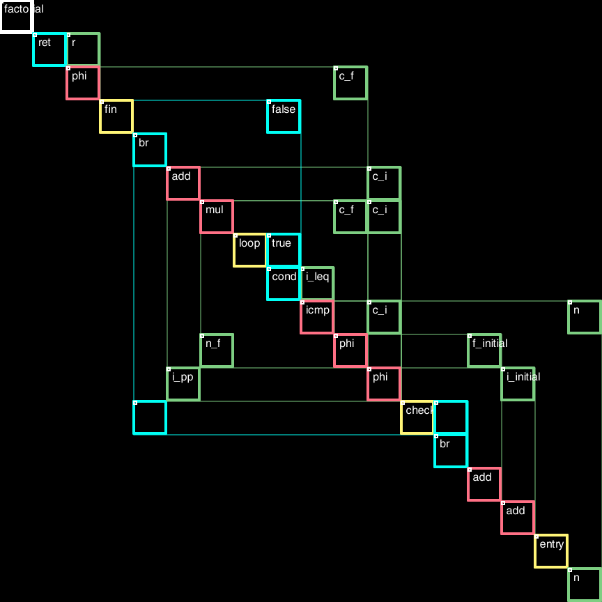

## RW

an experiment in presenting code

### WHY?

Spatial representation is of fundamental importance. It is the ground of meaning for a species that devoted more than half the neural processing power on tactile and visual stimuli. Failure of clumsy flow charts can't exhaust that.

### HOW?

Sparse matrices are extremely easy to read. Machines already excel at them. Digital displays do not waste empty space. Hear this out.

Sequence of instructions, hierarchy of syntax, web of bindings. All three need to be ready
for code to be present.

The actual experiment here is to anchor the sequential spine along the diagonal of an adjacency matrix.

Orthogonal frames nest very easily. Control-flow and data-flow graphs are not blurred. We are not talking about a half-baked graph layout. The interwoven structure can be read from the links scattered across the matrix, faithfully and transparently.
Cells around the diagonal represent local links; reaching further out around the corner.


Above is an initial rendering on a spreadsheet. Start from the bottom right and climb up to return statement
on the top left. Work against gravitational potential is too good to pass.

### WHERE?



```LLVM
define i32 @factorial(i32 %n) {
entry:
  %i_initial = add i32 2, 0
  %f_initial = add i32 1, 0
  br label %check
check:
  %c_i = phi i32 [%i_initial, %entry], [%i_pp, %loop]
  %c_f = phi i32 [%f_initial, %entry], [%n_f, %loop]
  %i_leq = icmp sle i32 %c_i, %n
  br i1 %i_leq, label %loop, label %fin
loop:
  %n_f = mul i32 %c_f, %c_i
  %i_pp = add i32 %c_i, 1
  br label %check
fin:
  %r = phi i32 [%c_f, %check]
  ret i32 %r
}
```
Above is the current presentation for factorial computation along with the llvm assembly input.


```LLVM
%ab = type {i32, i32}

define i32 @fibonacci(i32 %n) {
entry:
  %p = alloca %ab
  %p_a = getelementptr %ab, %ab* %p, i32 0, i32 0
  store i32 1, i32* %p_a
  %p_b = getelementptr %ab, %ab* %p, i32 0, i32 1
  store i32 1, i32* %p_b

  %i_init = add i32 1, 0
  br label %check
check:
  %c_i = phi i32 [%i_init, %entry], [%i_pp, %loop]
  %i_leq = icmp sle i32 %c_i, %n
  br i1 %i_leq, label %loop, label %fin
loop:
  %c_a = load i32, i32* %p_a
  %c_b = load i32, i32* %p_b
  %n_b = add i32 %c_a, %c_b
  store i32 %c_b, i32* %p_a
  store i32 %n_b, i32* %p_b

  %i_pp = add i32 %c_i, 1
  br label %check
fin:
  %r = load i32, i32* %p_b
  ret i32 %r
}
```
Above is for fibonacci with some pointer operations on the stack. Load and store is just too good to not see.

We let go of static renderings beyond these examples. At least in full detail. Some
form of folding is in the works.

### WHEN?

It would not have been wise to deal with sparse matrices on paper. Digital displays, on the other hand, are full of surprises.

### ASPIRATIONS

It would be good to have tools and toys we can break and make again. We need couplings we can trace and coalesce.

OS-COMPILER-EDITOR trio got somehow buried under the drag-n-drop interfaces and object oriented technology.
Easing the burden on heroic compilers and creating dwelling space close to machines may provide worthy challenges.

Real takes detail. Screens can support it. Document jumps or interactive tv make for astronomical burden on imagination. We should look at the wonderous over curious.

Assembly languages can be useful for assembling. 

Streamlined incremental compilation infrastructure is probably not a utopian dream.

The same spinal layout can be applied in different settings. Graphs are all around. This will be a first in a series of experiments to play with the representation as it is unique in being transparent.
